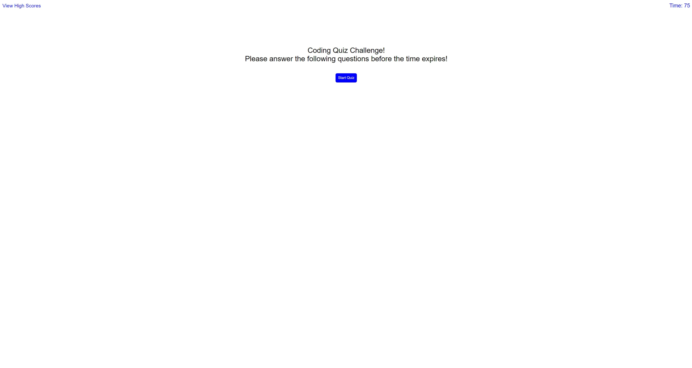
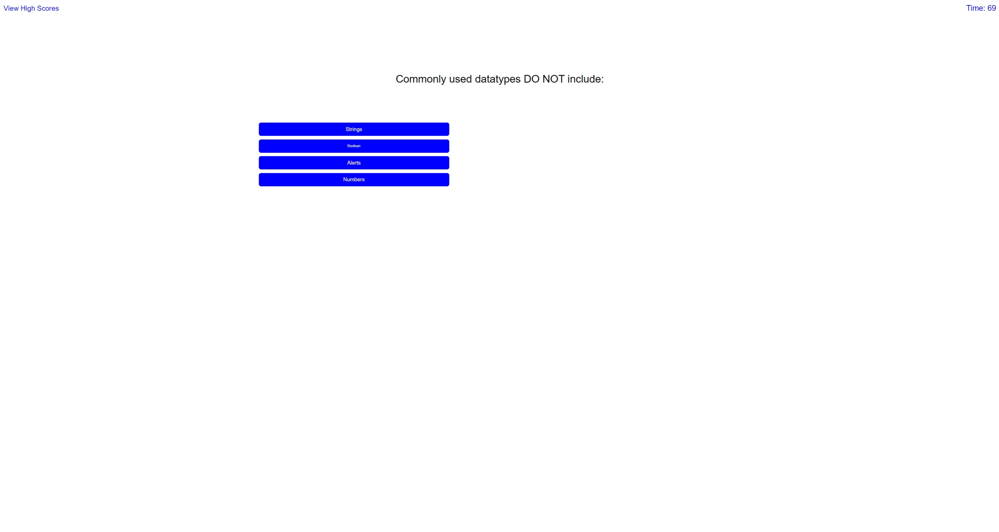

# coding-quiz-challenge

For this assignment I used mainly javascript to make this simple mock up coding quiz challenge while utilizing basic html and css to get started.
I was able to put a functioning start quiz button and timer as the countdown to complete the quiz before it runs out while creating a high score button that shows recorded high scores when the quiz is complete.

Once the quiz answers are all answered you are taken to a finished screen showing your score and a bar that lets you input your initials to record your score.

